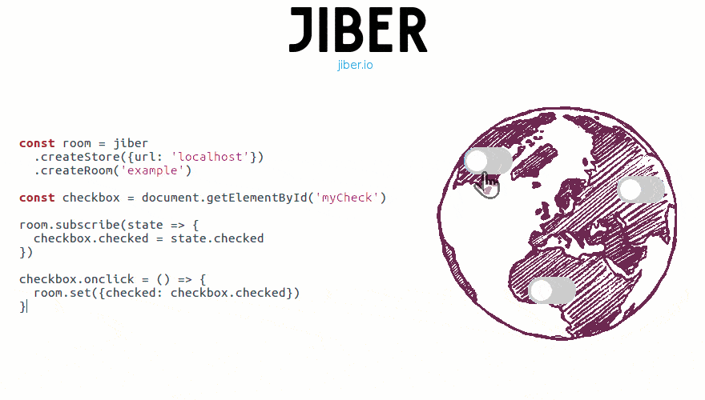

[](https://jiber.io)

[](https://travis-ci.org/jacob-grahn/jiber)
[](https://coveralls.io/github/jacob-grahn/jiber?branch=master)
[](https://greenkeeper.io/)

Jiber is an open source API for realtime web apps. It sets up peer-to-peer connections via webRTC, and backs that up with a more reliable client/server WebSocket connection.

- **Fast**: Updates are sent peer to peer to minimize latency.
- **Light**: jiber-client is 3kb, and has no dependencies.
- **Offline-First**: User actions are applied optimistically until a connection becomes available.

### Server Installation
```
npm i jiber-server
```

### Client Installation
```
npm i jiber-client
```

### Documentation
[Get Started with jiber-server](/packages/jiber-server)

[Get Started with jiber-client](/packages/jiber-client)

See Jiber's Docs at [docs.jiber.io](http://docs.jiber.io)

### Examples
Examples can be found in [/examples](/examples).

### Contributing
See [CONTRIBUTING.md](/CONTRIBUTING.md)

### License
MIT
